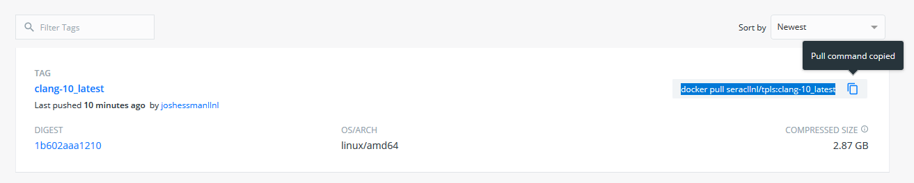
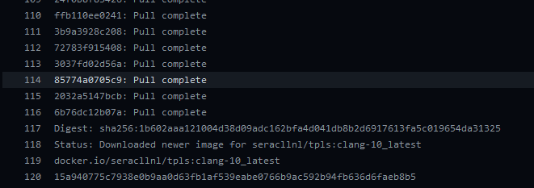

.. ## Copyright (c) 2019-2020, Lawrence Livermore National Security, LLC and
.. ## other Serac Project Developers. See the top-level COPYRIGHT file for details.
.. ##
.. ## SPDX-License-Identifier: (BSD-3-Clause)

====================================
Using a Docker Image for Development
====================================

If you haven't used Docker before, it is recommended that you check out the 
`Docker tutorial <https://docs.docker.com/get-started/>`_ before proceeding.

1. Clone a copy of the Serac repo to your computer: ``git clone --recursive https://github.com/LLNL/serac.git``

#. Once you've installed ``docker``, navigate to our `Dockerhub page <https://hub.docker.com/r/seracllnl/tpls/tags?page=1&ordering=last_updated>`_
   and select the most recent image corresponding to the compiler you'd like to use.  Clang 10 and GCC 8 images are currently offered.
#. Copy the pull command corresponding to the image you've selected (in this case, it's ``docker pull seracllnl/tpls:clang-10_latest``):

4. Next, run the copied command.  Our images are around 2.5 GB, so it may take a while for the image to be downloaded to your machine.
   When the download completes, you will see something like the following:

5. You can now run the image.  Run ``docker run -it -u serac -v /your/serac/repo:/home/serac/serac seracllnl/tpls:clang-10_latest bash``,
   replacing the tag (the compiler name following the ``tpls:``) with the tag you used in the ``docker pull`` command and
   replacing ``/your/serac/repo`` with the path to the Serac repo you cloned in the first step.  This will open a terminal into the image.

.. note::
   The ``-v`` option to ``docker run`` mounts a `Docker volume <https://docs.docker.com/storage/volumes/>`_ into the container.
   This means that part of your filesystem (in this case, your copy of the Serac repo) will be accessible from the container.

6. Follow the build instructions detailed in the :ref:`quickstart guide <build-label>`, using the host-config in ``host-configs/docker`` that
   corresponds to the compiler you've selected.  These commands should be run using the terminal you opened in the previous step. Due to issues
   with the docker bind-mount permissions, it is suggested that you set the build and install directories to be outside of the repository.

   .. code-block:: bash

      $ cd /home/serac/serac 
      $ python ./config-build.py -hc host-configs/docker/<container-host-config>.cmake -bp ../build -ip ../install
      $ cd ../build
      $ make -j4
      $ make test

#. You can now make modifications to the code from your host machine (e.g., via a graphical text editor), and use the Docker container
   terminal to recompile/run/test your changes.
