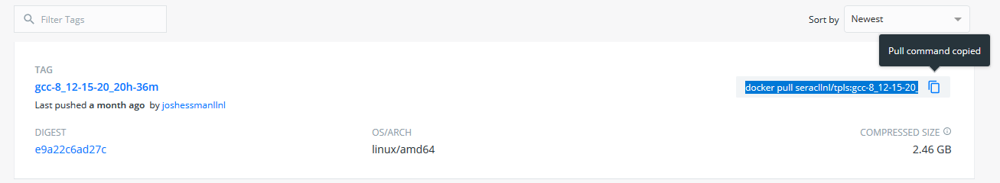
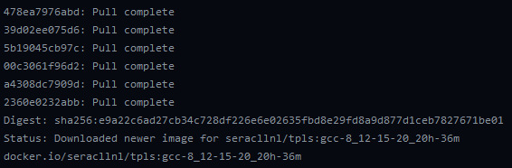

.. ## Copyright (c) Lawrence Livermore National Security, LLC and
.. ## other Smith Project Developers. See the top-level COPYRIGHT file for details.
.. ##
.. ## SPDX-License-Identifier: (BSD-3-Clause)

.. _docker-label:

====================================
Using a Docker Image for Development
====================================

If you haven't used Docker before, it is recommended that you check out the 
`Docker tutorial <https://docs.docker.com/get-started/>`_ before proceeding.

.. note::
   When using an Apple Silicon Mac, add ``--platform=linux/amd64`` to Docker commands because the Smith container
   images are built for the AMD64 architecture. We give examples of both.

.. note::
   Our docker images are uploaded to a grandfathered Docker Hub account named ```seracllnl``` as opposed to ``smith``.

1. Clone a copy of the Smith repo to your computer: ``git clone --recursive https://github.com/LLNL/smith.git``
2. Once you've installed ``docker``, navigate to our `Dockerhub page <https://hub.docker.com/r/seracllnl/tpls/tags?page=1&ordering=last_updated>`_
   and select the most recent image corresponding to the compiler you'd like to use.  `clang@19`` and `gcc@14`` images are currently offered.
3. Copy the pull command corresponding to the image you've selected. For example:

   .. code-block:: bash

      # General pull command for clang@19
      docker pull seracllnl/tpls:clang-19_latest
      # MacOS Apple silicone pull command for clang@19
      docker pull --platform=linux/amd64 seracllnl/tpls:clang-19_latest




4. Next, run the copied command.  Our images are around 4 GB, so it may take a while for the image to be downloaded to your machine.
   When the download completes, you will see something like the following:



5. You can now run the image.  Run the Docker image by replacing the tag (the compiler name following the ``tpls:``) with the tag
   you used in the ``docker pull`` command and replacing ``/your/smith/repo`` with the path to the Smith repo you cloned in the
   first step.  This will open a terminal into the image. For example:

   .. code-block:: bash

      # General run command for clang@19
      docker run -it -u smith -v /your/smith/repo:/home/smith/smith seracllnl/tpls:clang-19_latest /bin/bash
      # MacOS Apple silicone run command for clang@19
      docker run --platform=linux/amd64 -it -u smith -v /your/smith/repo:/home/smith/smith seracllnl/tpls:clang-19_latest /bin/bash


   .. note::
      The ``-v`` option to ``docker run`` mounts a `Docker volume <https://docs.docker.com/storage/volumes/>`_ into the container.
      This means that part of your filesystem (in this case, your copy of the Smith repo) will be accessible from the container.


6. Follow the build instructions detailed in :ref:`build_smith-label`, using the host-config in ``host-configs/docker`` that
   corresponds to the compiler you've selected.  These commands should be run using the terminal you opened in the previous step. Due to issues
   with the docker bind-mount permissions, it is suggested that you set the build and install directories to be outside of the repository.

   .. code-block:: bash

      $ cd /home/smith/smith
      $ python ./config-build.py -hc host-configs/docker/<container-host-config>.cmake -bp ../build -ip ../install
      $ cd ../build
      $ make -j4
      $ make test

7. You can now make modifications to the code from your host machine (e.g., via a graphical text editor), and use the Docker container
   terminal to recompile/run/test your changes.
