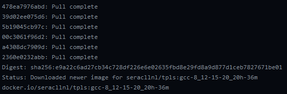

.. ## Copyright (c) 2019-2020, Lawrence Livermore National Security, LLC and
.. ## other Serac Project Developers. See the top-level COPYRIGHT file for details.
.. ##
.. ## SPDX-License-Identifier: (BSD-3-Clause)

===========
Docker Info
===========

Using a Docker image for development
------------------------------------

If you haven't used Docker before, it is recommended that you check out the 
`Docker tutorial <https://docs.docker.com/get-started/>`_ before proceeding.

1. Clone a copy of the Serac repo to your computer: ``git clone --recursive https://github.com/LLNL/serac.git``

#. Once you've installed ``docker``, navigate to our `Dockerhub page <https://hub.docker.com/r/seracllnl/tpls/tags?page=1&ordering=last_updated>`_
   and select find the most recent image corresponding to the compiler you'd like to use.  Clang 10 and GCC 8 images are currently offered.
#. Copy the pull command corresponding to the image you've selected (in this case, it's ``docker pull seracllnl/tpls:gcc-8_12-15-20_20h-36m``):

.. image:: copy_pull_cmd.png
   :scale: 50 %

4. Next, run the copied command.  Our images are around 2.5 GB, so it may take a while for the image to be downloaded to your machine.
   When the download completes, you will see something like the following:

5. You can now run the image.  Run ``docker run -it -u serac -v /your/serac/repo:/home/serac/serac seracllnl/tpls:gcc-8_12-15-20_20h-36m bash``,
   replacing the tag (the compiler/timestamp combo following the ``tpls:``) with the tag you used in the ``docker pull`` command and
   replacing ``/your/serac/repo`` with the path to the Serac repo you cloned in the first step.  This will open a terminal into the image.

.. note::
   The ``-v`` option to ``docker run`` mounts a `Docker volume <https://docs.docker.com/storage/volumes/>`_ into the container.
   This means that part of your filesystem (in this case, your copy of the Serac repo) will be accessible from the container.

6. Follow the build instructions detailed in :ref:`building-serac`, using the host-config in ``host-configs/docker`` that
   corresponds to the compiler you've selected.  These commands should be run using the terminal you opened in the previous step.

#. You can now make modifications to the code from your host machine (e.g., via a graphical text editor), and use the Docker container
   terminal to recompile/run/test your changes.

Building a new image
--------------------

The following instructions apply to the creation of a new compiler image.

    1. If a Dockerfile for the desired compiler already exists, you can just use GitHub actions to build the image (see step 7).
    #. Start by cloning down the ``serac`` repository.  
    #. Ensure that an Axom image exists on Dockerhub for the desired compiler.
       If no corresponding Axom compiler image exists, it should be 
       created before proceeding.
    #. Go to the ``scripts/docker`` directory and run ``build_new_dockerfile.sh``, passing the compiler
       name and version, e.g. for Clang 10, run ``./build_new_dockerfile.sh clang 10``.  Minor versions can also be specified,
       for example, GCC 9.3 can be specified with ``./build_new_dockerfile.sh gcc 9.3``.  This will create a Dockerfile whose
       name corresponds to a specific compiler, e.g., ``dockerfile_clang-10``.  This may require modifications depending on the
       compiler and base image - for example, an extra system package might be installed so Spack doesn't need to build it from source.
    #. Edit ``./github/workflows/docker_build_tpls.yml`` to add new job for the new compiler image.  This can be copy-pasted 
       from one of the existing jobs - the only things that must be changed are the job name and ``TAG``, which should match the
       name of the compiler/generated ``Dockerfile``.  For example, a build for ``dockerfile_clang-10`` must set ``TAG``
       to ``clang-10``.  For clarity, the ``name`` field for the job should also be updated.
    #. Commit and push the modified YML file and new Dockerfile, then go to the Actions tab on GitHub, select the "Docker TPL Build"
       action, and run the workflow on the branch to which the above changes were pushed.
    #. Once the "Docker TPL Build" action completes, it will produce artifacts for each of the generated host-configs.  Download these 
       artifacts and commit them to the active branch, replacing any part of the filename preceding ``linux`` with ``docker``.  
       Currently the part that needs to be replaced is ``buildkitsandbox``.
    #. To include the new image in CI jobs, add a new ``matrix`` entry to ``azure-pipelines.yml``, modifying its 
       attributes with the appropriate new image name (which is timestamped) and new host-config file.
