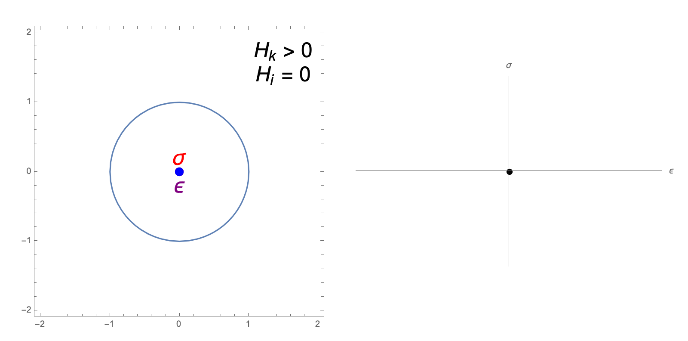
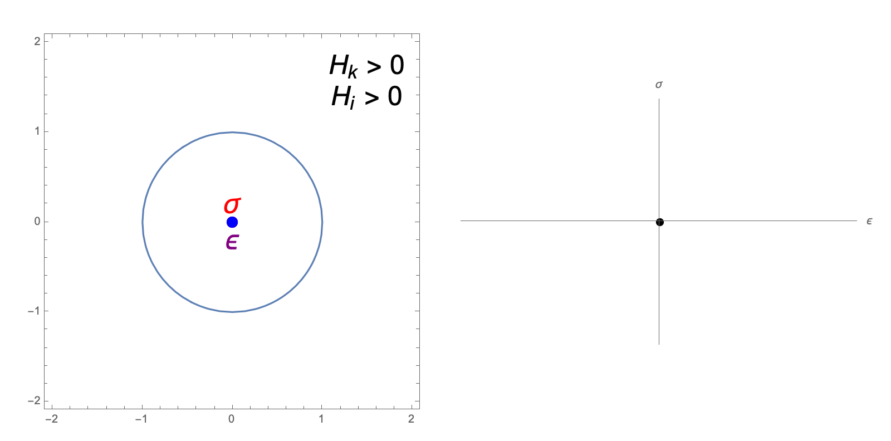

.. ## Copyright (c) 2019-2023, Lawrence Livermore National Security, LLC and
.. ## other Serac Project Developers. See the top-level COPYRIGHT file for details.
.. ##
.. ## SPDX-License-Identifier: (BSD-3-Clause)

.. _solidmechanics-theory-label:

===============
Solid Mechanics
===============

Strong Form
===========

Consider the kinematics of finite deformation

.. image:: ../figures/deformed_body.png
   :width: 80 %
   :align: center

where :math:`\mathbf{x}(\mathbf{X}, t)` is the current position of a
point originally located at :math:`\mathbf{X}` in the undeformed (or
reference) configuration. This motion is also commonly described in
terms of the displacement

.. math:: \mathbf{u}(\mathbf{X},t) = \mathbf{x}(\mathbf{X}, t) - \mathbf{X}.

An important quantity characterizing this motion is the *deformation
gradient*

.. math:: \mathbf{F} = \frac{\partial\mathbf{x}}{\partial\mathbf{X}} = \frac{\partial \mathbf{u}}{\partial \mathbf{X}} + \mathbf{I}.

We also define the internal forces due to deformation in the solid in
terms of the *Cauchy stress* :math:`\mathbf{\sigma}`. If the deformed
body is cut by a surface with normal vector :math:`\mathbf{n}`, the resulting
traction vector :math:`\mathbf{t}` is defined as

.. math:: \mathbf{t} = \mathbf{\sigma} \mathbf{n}.

This stress is taken here as a function of the deformation gradient
:math:`\sigma  = \sigma(\mathbf{F})` by the appropriate hyperelastic constitutive
(material) model. The conservation of angular momentum implies this
stress tensor must be symmetric, i.e. :math:`\sigma = \sigma^T`. We can
then use the conservation of linear momentum to formulate the boundary
value problem

.. math::

   \begin{align*}
   \nabla_\mathbf{x} \cdot \mathbf{\sigma}(\mathbf{F}) + \rho \mathbf{b} &= \rho \ddot{\mathbf{u}} \\
   \mathbf{u} &= \mathbf{u}_D & \text{on } \Gamma_D \\
   \sigma \mathbf{n} &= \mathbf{t} & \text{on } \Gamma_N \\
   \mathbf{u}(\mathbf{x}, 0) & = \mathbf{u}_0 \\
   \dot{\mathbf{u}}(\mathbf{x},0) & = \dot{\mathbf{u}}_0
   \end{align*}

where

.. math::

   \begin{align*}
   \sigma(\mathbf{F}) &= \text{Cauchy stress via constitutive response} \\
   \rho &= \text{density} \\
   \mathbf{b} &= \text{body force} \\
   \mathbf{u}_D & = \text{fixed boundary} \\
   \mathbf{t} &= \text{boundary traction} \\
   \mathbf{u}_0 &= \text{initial displacement} \\
   \dot{\mathbf{u}}_0 &= \text{initial velocity}
   \end{align*}

and :math:`\nabla_\mathbf{x}` implies the gradient with respect to the
current (deformed) configuration. 

Weak Form
=========

Multiplying the PDE by a vector-valued
test function :math:`\delta \mathbf{v}` and integrating by parts yields
the weak form

.. math::

   \begin{align*}
   &\text{Find } \mathbf{u} \in \mathbf{U} \text{ such that}\\
   &\int_{\Omega_t} \left( \sigma(\mathbf{u}) \cdot \nabla_\mathbf{x} \delta \mathbf{v} - \rho \mathbf{b} \cdot \delta \mathbf{v}\right) dV - \int_{\Gamma_{N_t}} \delta\mathbf{v}\cdot \mathbf{t}\, dA + \int_{\Omega_t} \rho\ddot{\mathbf{u}} \cdot \delta\mathbf{v} \,dV = 0, & & \forall \delta\mathbf{v} \in \hat{\mathbf{U}}
   \end{align*}

where

.. math::

   \begin{align*}
   \mathbf{U} &= \left\{ \mathbf{u} \in H_1^\text{dim}(\Omega):\mathbf{u}=\mathbf{u}_D \text{ on } \Gamma_D \right\} \\
   \hat{\mathbf{U}} &= \left\{\mathbf{u} \in H_1^\text{dim}(\Omega):\mathbf{u}=\mathbf{0} \text{ on } \Gamma_D \right\}.
   \end{align*}

and :math:`\Omega` is the current (deformed) configuration. In
mechanics, the weak form is often referred to as the *principle of
virtual power*. As Serac uses hyperelastic models, it is convenient to
write this equation in the reference (undeformed) configuration

.. math::

   \begin{align*}
   &\int_{\Omega_0} \sigma(\mathbf{u}) \cdot \left(\nabla_\mathbf{X} \delta \mathbf{v} \mathbf{F}^{-1} \right) \text{det}\mathbf{F}\, dV_0  - \int_{\Omega_0} \rho_0 \mathbf{b} \cdot \delta \mathbf{v} dV_0 \\ 
   & \;\;\;\;\;\;\;\;\;\;\;\; - \int_{\Gamma_{N_0}} \delta\mathbf{v}\cdot \mathbf{t}\,||\mathbf{F}^{-T}\mathbf{n}_0||\text{det}\mathbf{F}\, dA_0 + \int_{\Omega_0} \rho_0\ddot{\mathbf{u}} \cdot \delta\mathbf{v}\, dV_0= 0, & & \forall \delta\mathbf{v} \in \hat{\mathbf{U}}
   \end{align*}

where :math:`\nabla_X` is the gradient with respect to the reference (material) coordinates.

Material Models
===============

Serac currently is restricted to *hyperelastic* material formulations, i.e. materials that behave in a reversibly elastic fashion 
under large deformations. Mathematically, this implies they are derived from a *strain energy density* function 
:math:`W=W(\mathbf{F})`. It can be shown that

.. math::

   \sigma(\mathbf{F}) = \frac{1}{\text{det}\mathbf{F}} \frac{\partial W}{\partial \mathbf{F}} \mathbf{F}^T  = \frac{1}{\text{det}\mathbf{F}} \mathbf{P}  \mathbf{F}^T

where

.. math::

   \mathbf{P} =  \frac{\partial W}{\partial \mathbf{F}} = {\text{det}}\mathbf{F} \sigma \mathbf{F}^{-T}

is the *first Piola-Kirchhoff stress*. Serac currently only has two material models. First, a neo-Hookean material where
   
.. math::

   \begin{align*}
   W(\mathbf{F}) &= \frac{\mu}{2}(\bar{I}_1 - \text{dim}) + \frac{K}{2}(\text{det}\mathbf{F} - 1)^2 \\
   \bar{I}_1 &= \frac{\text{trace}(\mathbf{F}\mathbf{F}^T)}{(\text{det}\mathbf{F})^{2/\text{dim}}}
   \end{align*}

and :math:`\mu` and :math:`K` are the shear and bulk modulus, respectively. This definition also
implies that the 2D simulations are using a plane strain assumption. The second model is a small strain isotropic linear elastic material where

.. math::

   \begin{align*}
   \sigma(\epsilon) &= \lambda \text{trace}(\epsilon) \mathbf{I} + 2\mu \epsilon \\
   \epsilon &= \frac{1}{2}\left(\mathbf{F} + \mathbf{F}^T \right) - \mathbf{I} \\
   \lambda &= K - \frac{2}{\text{dim}} \mu
   \end{align*}

and :math:`\epsilon` is the linearized strain tensor. Note that this model is only valid for small strains 
where the neo-Hookean model is nearly equivalent. It is included mostly for testing purposes.

Discretization
==============

We discretize the displacement field using nodal shape functions, i.e.

.. math::

   \mathbf{u} (\mathbf{X}) = \sum_{a=1}^n N^a (\mathbf{X}) \mathbf{u}^a

where :math:`\mathbf{u}^a` are the degrees of freedom. We can then calculate the deformation gradient by

.. math::

   \mathbf{F} = \mathbf{I} + \sum_{a=1}^n \frac{\partial N^a}{\partial \mathbf{X}} \mathbf{u}^a

and substitute these quantities back into the weak form to obtain the vector-valued discrete residual equation

.. math::

   \int_{\Omega_0} \sigma \frac{\partial N^a}{\partial \mathbf{X}} \mathbf{F}^{-1} \text{det}\mathbf{F} \, dV_0  - \int_{\Omega_0} \rho_0 \mathbf{b} N^a dV_0  - \int_{\Gamma_{N_0}} \mathbf{t}^* N^a \, dA_0 + \int_{\Omega_0} \rho_0\ddot{\mathbf{u}}N^a\, dV_0 = 0

where :math:`\mathbf{t}^*` is the traction applied in the reference configuration. 

Optionally, we allow disabling the geometric nonlinearities by setting :math:`\mathbf{F} = \mathbf{I}` everywhere
in this residual evaluation except for the material response (stress) function. 

Performing these integrals yields the discrete equations

.. math::

   H(\mathbf{u}) - \mathbf{f} - \mathbf{g} + \mathbf{M}\ddot{\mathbf{u}} = 0

where

.. math::

   \begin{align*}
   \mathbf{u} &= \text{displacement degree of freedom vector (unknowns)} \\
   \mathbf{M} &= \text{mass matrix} \\
   H(\mathbf{u}) &= \text{nonlinear internal force vector} \\
   \mathbf{f} &= \text{body force} \\
   \mathbf{g} &= \text{traction vector}. \\
   \end{align*}

This discrete nonlinear second order ODE system can now be solved using the selected linear algebra methods.

Material Parameters
======================

Material models in serac may use different parameters for describing elastic properties. Specifying
any two of these parameters lets you calculate the rest. The tool below can be used to 
perform these conversion calculations (assuming 3D):

.. raw:: html

  <input type="number" id="K" onchange="update_K()"> Bulk Modulus (K)  
  <input type="number" id="E" onchange="update_E()"> Young's Modulus (E)  
  <input type="number" id="lambda" onchange="update_lambda()"> Lamé's First Parameter (λ)  
  <input type="number" id="G" onchange="update_G()"> Shear Modulus (G, μ)  
  <input type="number" id="nu" onchange="update_nu()"> Poisson's Ratio (ν)  
  
  

J2 Linear Hardening Parameters
------------------------------

The hardening constants, :math:`H_i, H_k`, in our J2 material model describe the extent to which
the yield surface dilates and translates, respectively, when undergoing plastic deformation. 
The following animations illustrate the evolution of the yield surface and stress-strain relationship
when subjected to cyclic strain, for different choices of :math:`H_i, H_k`.

"Perfectly Plastic" response: zero isotropic and kinematic hardening

--------

isotropic hardening only

--------

kinematic hardening only

--------

isotropic and kinematic hardening

Contact mechanics
=================

When two surfaces on :math:`\Omega` (the current configuration of the simulation domain) come into contact, an
additional term in the weak form is needed to prevent their interpenetration. For contact enforcement without friction,
the mechanical energy from contact is

.. math:: 

   \Pi_C = \int_{\Gamma_C^1} p(\bar{\mathbf{x}}) \bigl( \mathbf{n}(\bar{\mathbf{x}}) \cdot \mathbf{x}_1(\bar{\mathbf{x}}) \bigr) \, dA 
   - \int_{\Gamma_C^2} p(\bar{\mathbf{x}}) \bigl( \mathbf{n}(\bar{\mathbf{x}}) \cdot \mathbf{x}_2(\bar{\mathbf{x}}) \bigr) \, dA ,

where

.. math::

   \begin{align*}
   \Gamma_C^1 \subset \partial \Omega &= \text{contact surface 1 (}nonmortar\text{ surface)}, \\
   \Gamma_C^2 \subset \partial \Omega &= \text{contact surface 2 (}mortar\text{ surface)}, \\
   \bar{\mathbf{x}} \in \Gamma_C &= \text{a coordinate on }\Gamma_C\text{, a surface with a bijective map to }\Gamma_C^1\text{ and }\Gamma_C^2, \\
   p(\bar{\mathbf{x}}) &= \text{pressure field}, \\
   \mathbf{n}(\bar{\mathbf{x}}) & = \text{unit normal vector}, \\
   \mathbf{x}_1(\bar{\mathbf{x}}) \in \Gamma_C^1 &= \text{a coordinate on }\Gamma_C^1,\text{ and} \\
   \mathbf{x}_2(\bar{\mathbf{x}}) \in \Gamma_C^2 &= \text{a coordinate on }\Gamma_C^2 .
   \end{align*}

Using the common surface, :math:`\Gamma_C`, the contact energy can be simplified to a single term:

.. math::

   \Pi_C = \int_{\Gamma_C} p(\bar{\mathbf{x}}) g(\bar{\mathbf{x}}) \, dA ,

where :math:`g(\bar{\mathbf{x}}) := \mathbf{n}(\bar{\mathbf{x}}) \cdot \bigl( \mathbf{x}_1 (\bar{\mathbf{x}}) -
\mathbf{x}_2 (\bar{\mathbf{x}}) \bigr)` is the gap normal. Taking variations of this with respect to displacement leads
to the contact term in the weak form.

Mortar contact
--------------

While notionally straightforward, the complexity (both in mathematical derivation and computation) of accurately
computing the variation of the contact energy leads to many different simplifications and approximations in actual
contact algorithms. Serac uses the mortar contact method in the `Tribol <https://github.com/LLNL/Tribol>`_ interface
physics library for contact enforcement. In Tribol, mortar contact enforcement is implemented following `Puso and
Laursen (2004) <https://doi.org/10.1016/j.cma.2003.10.010>`_. Therein, contact constraints are only satisfied in the
normal direction, enabling constraints that enforce either frictionless contact (inequality constraints) or tied contact
in the normal direction (equality constraints).

Mortar methods are defined by introducing an approximation of the pressure field with :math:`n` basis functions
:math:`N^a(\bar{\mathbf{x}})` for :math:`a = 1, \dotsc n` and :math:`n` scalar coefficients :math:`p^a` for :math:`a =
1, \dotsc n`,

.. math::

   p(\bar{\mathbf{x}}) = \sum_{a=1}^n N^a(\bar{\mathbf{x}}) p^a ,

allowing the contact energy expression to be simplified to

.. math::

   \Pi_C = \sum_{a=1}^n p^a \tilde{g}^a(\bar{\mathbf{x}}) ,

where :math:`\tilde{g}^a(\bar{\mathbf{x}}) = \int_{\Gamma_C} N_I(\bar{\mathbf{x}}) g(\bar{\mathbf{x}}) \, dA`. For
frictionless contact, satisfaction of the Karush-Kuhn-Tucker (KKT) conditions that define the contact inequality
constraints are then done discretely on the coefficients:

.. math::

   \tilde{g}^a \leq 0 \qquad p^a \geq 0 \qquad \tilde{g}^a p^a = 0 .

Discrete satisfaction of the inequality constraints (or equality constraints for tied contact in the normal direction),
as opposed to e.g. pointwise satisfaction at the quadrature points, gives LBB stability, enabling exact solution of the
pressure field by explicitly solving for the Lagrange multipliers in the resulting saddle point system.  Additionally,
mortar methods give optimal rates of convergence (when not limited by solution regularity) and give exact satisfaction
of the contact patch test.

In Puso and Laursen (2004), the following choices are made for the quantities defined in the contact energy: 

#. :math:`\mathbf{n}(\bar{\mathbf{x}}) := \mathbf{n}(\mathbf{x}_1)` is a nodally interpolated, continuous field defined
   in terms of :math:`\Gamma_C^1` where nodal values are determined by averaging normals evaluated at the nodal location
   in each element that is connected to the node.
#. :math:`\Gamma_C` is defined for each pair of elements in contact by a multi-step process. First, a plane is defined
   on the element in the pair on :math:`\Gamma_C^1` by the point at the element center and the nodally interpolated
   normal vector :math:`\mathbf{n}(\mathbf{x}_1)` evaluated at the element center. Next, the nodes from each element
   are projected onto the plane and the overlap polygon is computed. The overlap polygon defines :math:`\Gamma_C` for
   the element pair.
#. The surface :math:`\Gamma_C` also defines the maps :math:`\mathbf{x}_1(\bar{\mathbf{x}})` and
   :math:`\mathbf{x}_2(\bar{\mathbf{x}})` via the projection of the nodes to the plane normal to the center of the
   element on :math:`\Gamma_C^1`.
#. :math:`p(\bar{\mathbf{x}})` is an :math:`H_1(\Gamma_C^1)` field defined on the nonmortar surface using the same
   discretization as the position and displacement fields.

Additionally, the definition of :math:`\tilde{g}^a` is modified to

.. math::

   \tilde{g}^a(\bar{\mathbf{x}}) = \mathbf{n}(\mathbf{x}_1) \cdot 
   \int_{\Gamma_C} N^a_1(\bar{\mathbf{x}}) \bigl( \mathbf{x}_1(\bar{\mathbf{x}}) - \mathbf{x}_2(\bar{\mathbf{x}}) \bigr) \, dA ,

which does not affect the smoothness of the solution since :math:`\mathbf{n}(\mathbf{x}_1) \in
{C^0}^\text{dim}(\Gamma_C^1)` is nodally interpolated.

The expression for contact force is simplified through the assumption that terms that contain
:math:`\tilde{g}(\bar{\mathbf{x}})` only contribute minimally and are ignored. Note that neglecting these terms affects
angular momentum conservation and energy conservation since the formulation is not variationally consistent. After
introducing finite element approximations for :math:`\mathbf{x}_1` and :math:`\mathbf{x}_2`, the nodal contact forces
are

.. math::

   \mathbf{f}_I^a = (-1)^{I + 1} \sum_{b=1}^{n^1} p^b \mathbf{n}(\mathbf{x}^b_1) 
   \int_{\Gamma_C} N_1^b(\bar{\mathbf{x}}) N_I^a(\bar{\mathbf{x}}) \, dA ,
   
where :math:`\mathbf{f}_I^a` is the force vector on node :math:`a` of surface :math:`\Gamma_C^I` for :math:`I=1,2` and
:math:`N_I^a(\bar{\mathbf{x}})` is the basis function associated with node :math:`a` of surface :math:`\Gamma_C^I` for
:math:`I=1,2`.  In the above equation, :math:`\int_{\Gamma_C} N_1^b(\bar{\mathbf{x}}) N_I^a(\bar{\mathbf{x}}) \, dA` is
usually referred to as the *mortar matrix*. In Serac, the pressure degrees-of-freedom can be determined by one of two
ways:

#. by introducing Lagrange multipliers as unknowns and explicitly solving for them or
#. by using a penalty proportional to the gap: :math:`p^b = \kappa g^b`.

The tangent is computed by taking variations of the force with respect to the displacement (and the pressure when
solving for Lagrange multipliers). Similar to taking variations of the contact energy, taking variations of the contact
force is a difficult, time consuming task, both computationally and mathematically. While Puso and Laursen (2004)
present a consistent tangent, the tangent implemented in Tribol is only an approximation. Terms where
:math:`\tilde{g}(\bar{\mathbf{x}})` is present are assumed to be :math:`\approx 0`. As a result, quadratic convergence
in Newton iterations is not expected when contact terms are included in the weak form.
