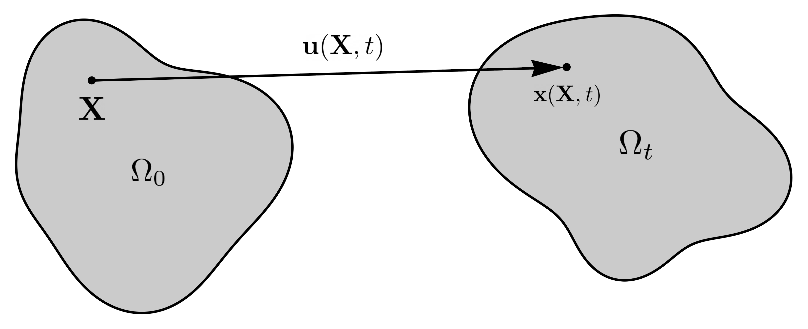

.. ## Copyright (c) 2019-2021, Lawrence Livermore National Security, LLC and
.. ## other Serac Project Developers. See the top-level COPYRIGHT file for details.
.. ##
.. ## SPDX-License-Identifier: (BSD-3-Clause)

===============
Solid Mechanics
===============

Strong Form
===========

Consider the kinematics of finite deformation

where :math:`\mathbf{x}(\mathbf{X}, t)` is the current position of a
point originally located at :math:`\mathbf{X}` in the undeformed (or
reference) configuration. This motion is also commonly described in
terms of the displacement

.. math:: \mathbf{u}(\mathbf{X},t) = \mathbf{x}(\mathbf{X}, t) - \mathbf{X}.

An important quantity characterizing this motion is the *deformation
gradient*

.. math:: \mathbf{F} = \frac{\partial\mathbf{x}}{\partial\mathbf{X}} = \frac{\partial \mathbf{u}}{\partial \mathbf{X}} + \mathbf{I}.

We also define the internal forces due to deformation in the solid in
terms of the *Cauchy stress* :math:`\mathbf{\sigma}`. If the deformed
body is cut surface with normal vector :math:`\mathbf{n}`, the resulting
traction vector :math:`\mathbf{t}` is defined as

.. math:: \mathbf{t} = \mathbf{\sigma} \mathbf{n}.

This stress is a function of the deformation gradient
:math:`\sigma  = \sigma(\mathbf{F})` by the appropriate hyperelastic constitutive
(material) model. The conservation of angular momentum implies this
stress tensor must be symmetric, i.e. :math:`\sigma = \sigma^T`. We can
then use the conservation of linear momentum to formulate the boundary
value problem

.. math::

   \begin{align*}
   \nabla_\mathbf{x} \cdot \mathbf{\sigma}(\mathbf{F}) + \rho \mathbf{b} &= \rho \ddot{\mathbf{u}} \\
   \mathbf{u} &= \mathbf{u}_D & \text{on } \Gamma_D \\
   \sigma \mathbf{n} &= \mathbf{t} & \text{on } \Gamma_N \\
   \mathbf{u}(\mathbf{x}, 0) & = \mathbf{u}_0 \\
   \dot{\mathbf{u}}(\mathbf{x},0) & = \dot{\mathbf{u}}_0
   \end{align*}

where

.. math::

   \begin{align*}
   \sigma(\mathbf{F}) &= \text{Cauchy stress via constitutive response} \\
   \rho &= \text{density} \\
   \mathbf{b} &= \text{body force} \\
   \mathbf{u}_D & = \text{fixed boundary} \\
   \mathbf{t} &= \text{boundary traction} \\
   \mathbf{u}_0 &= \text{initial displacement} \\
   \dot{\mathbf{u}}_0 &= \text{initial velocity}
   \end{align*}

and :math:`\nabla_\mathbf{x}` implies the gradient with respect to the
current (deformed) configuration. 

Weak Form
=========

Multiplying the PDE by a vector-valued
test function :math:`\delta \mathbf{v}` and integrating by parts yields
the weak form

.. math::

   \begin{align*}
   &\text{Find } \mathbf{u} \in \mathbf{U} \text{ such that}\\
   &\int_{\Omega_t} \left( \sigma(\mathbf{u}) \cdot \nabla_\mathbf{x} \delta \mathbf{v} - \rho \mathbf{b} \cdot \delta \mathbf{v}\right) dV - \int_{\Gamma_{N_t}} \delta\mathbf{v}\cdot \mathbf{t}\, dA + \int_{\Omega_t} \rho\ddot{\mathbf{u}} \cdot \delta\mathbf{v} \,dV = 0, & & \forall \delta\mathbf{v} \in \hat{\mathbf{U}}
   \end{align*}

where

.. math::

   \begin{align*}
   \mathbf{U} &= \left\{ \mathbf{u} \in H_1^\text{dim}(\Omega):\mathbf{u}=\mathbf{u}_D \text{ on } \Gamma_D \right\} \\
   \hat{\mathbf{U}} &= \left\{\mathbf{u} \in H_1^\text{dim}(\Omega):\mathbf{u}=\mathbf{0} \text{ on } \Gamma_D \right\}.
   \end{align*}

and :math:`\Omega` is the current (deformed) configuration. In
mechanics, the weak form is often referred to as the *principle of
virtual power*. As Serac uses hyperelastic models, it is convenient to
write this equation in the reference (undeformed) configuration

.. math::

   \begin{align*}
   &\int_{\Omega_0} \sigma(\mathbf{u}) \cdot \left(\nabla_\mathbf{X} \delta \mathbf{v} \mathbf{F}^{-1} \right) \text{det}\mathbf{F}\, dV_0  - \int_{\Omega_0} \rho_0 \mathbf{b} \cdot \delta \mathbf{v} dV_0 \\ 
   & \; \; \; \; \; \;\;\;\;\;\;\; - \int_{\Gamma_{N_0}} \delta\mathbf{v}\cdot \mathbf{t}\,||\mathbf{F}^{-T}\mathbf{n}_0||\text{det}\mathbf{F}\, dA_0 + \int_{\Omega_0} \rho_0\ddot{\mathbf{u}} \cdot \delta\mathbf{v}\, dV_0= 0, & & \forall \delta\mathbf{v} \in \hat{\mathbf{U}}
   \end{align*}

where :math:`\nabla_X` is the gradient with respect to the reference (material) coordinates.

Material Models
===============

Serac uses *hyperelastic* material formulations, i.e. materials that behave elastically under large deformations. Mathemaically,
this implies they are derived from a *strain energy density* function :math:`W=W(\mathbf{F})`. It can be shown that

.. math::

   \sigma(\mathbf{F}) = \frac{1}{\text{det}\mathbf{F}} \frac{\partial W}{\partial \mathbf{F}} \mathbf{F}^T  = \frac{1}{\text{det}\mathbf{F}} \mathbf{P}  \mathbf{F}^T

where

.. math::

   \mathbf{P} =  \frac{\partial W}{\partial \mathbf{F}} = {\text{det}}\mathbf{F} \sigma \mathbf{F}^{-T}

is the *first Piola-Kirchhoff stress*. Serac currently only has two material models. First, a neo-Hookean material where
   
.. math::

   \begin{align*}
   W(\mathbf{F}) &= \frac{\mu}{2}(\bar{I}_1 - \text{dim}) + \frac{K}{2}(\text{det}\mathbf{F} - 1)^2 \\
   \bar{I}_1 &= \frac{\text{trace}(\mathbf{F}\mathbf{F}^T)}{(\text{det}\mathbf{F})^{2/\text{dim}}}
   \end{align*}

and :math:`\mu` and :math:`K` are the shear and bulk modulus, respectively. This definition also
implies that the 2D simulations are using a plane strain assumption. The second model a small strain isotropic linear elastic material where

.. math::

   \begin{align*}
   \sigma(\epsilon) &= \lambda \text{trace}(\epsilon) \mathbf{I} + 2\mu \epsilon \\
   \epsilon &= \frac{1}{2}\left(\mathbf{F} + \mathbf{F}^T \right) - \mathbf{I} \\
   \lambda &= K - \frac{2}{\text{dim}} \mu
   \end{align*}

and :math:`\epsilon` is the linearized strain tensor. Note that this model is only valid for small strains 
where the neo-Hookean model is nearly equivalent. It is included mostly for testing purposes.

Optionally, we can also model linear viscoelasticity by adding

.. math::

   \sigma(\dot{\epsilon}) = \eta \dot{\epsilon}

to the stress calculations in dynamic simulations.

Discretization
==============

We discretize the displacement field using nodal shape functions, i.e.

.. math::

   \mathbf{u} (\mathbf{X}) = \sum_{a=1}^n N^a (\mathbf{X}) \mathbf{u}^a

where :math:`\mathbf{u}^a` are the degrees of freedom. We can then calculate the deformation gradient by

.. math::

   \mathbf{F} = \mathbf{I} + \sum_{a=1}^n \frac{\partial N^a}{\partial \mathbf{X}} \mathbf{u}^a

and subsitutite these quantities back into the weak form to obtain the vector-valued discrete residual equation

.. math::

   \int_{\Omega_0} \tau \frac{\partial N^a}{\mathbf{X}} \mathbf{F}^{-1} \, dV_0  - \int_{\Omega_0} \rho_0 \mathbf{b} N^a dV_0  - \int_{\Gamma_{N_0}} \mathbf{t}^* N^a \, dA_0 + \int_{\Omega_0} \rho_0\ddot{\mathbf{u}}N^a\, dV_0 = 0

where :math:`\tau = \sigma \, \text{det}\mathbf{F}` is the Kirchhoff stress and :math:`\mathbf{t}^*` 
is the traction applied in the reference configuration.