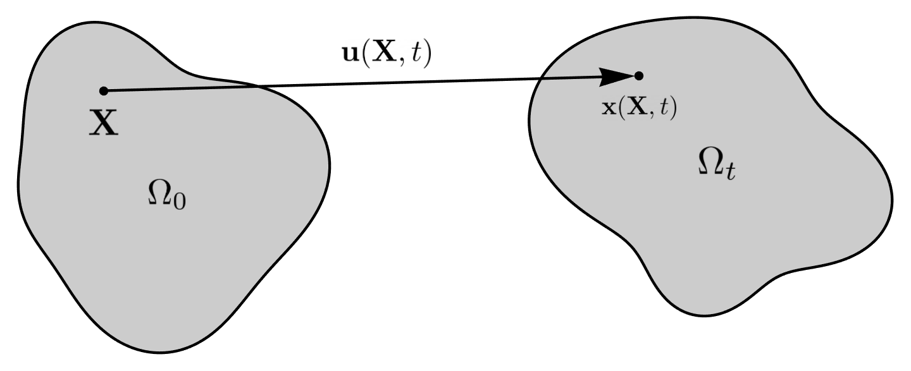

.. ## Copyright (c) 2019-2022, Lawrence Livermore National Security, LLC and
.. ## other Serac Project Developers. See the top-level COPYRIGHT file for details.
.. ##
.. ## SPDX-License-Identifier: (BSD-3-Clause)

===============
Solid Mechanics
===============

Strong Form
===========

Consider the kinematics of finite deformation

where :math:`\mathbf{x}(\mathbf{X}, t)` is the current position of a
point originally located at :math:`\mathbf{X}` in the undeformed (or
reference) configuration. This motion is also commonly described in
terms of the displacement

.. math:: \mathbf{u}(\mathbf{X},t) = \mathbf{x}(\mathbf{X}, t) - \mathbf{X}.

An important quantity characterizing this motion is the *deformation
gradient*

.. math:: \mathbf{F} = \frac{\partial\mathbf{x}}{\partial\mathbf{X}} = \frac{\partial \mathbf{u}}{\partial \mathbf{X}} + \mathbf{I}.

We also define the internal forces due to deformation in the solid in
terms of the *Cauchy stress* :math:`\mathbf{\sigma}`. If the deformed
body is cut by a surface with normal vector :math:`\mathbf{n}`, the resulting
traction vector :math:`\mathbf{t}` is defined as

.. math:: \mathbf{t} = \mathbf{\sigma} \mathbf{n}.

This stress is taken here as a function of the deformation gradient
:math:`\sigma  = \sigma(\mathbf{F})` by the appropriate hyperelastic constitutive
(material) model. The conservation of angular momentum implies this
stress tensor must be symmetric, i.e. :math:`\sigma = \sigma^T`. We can
then use the conservation of linear momentum to formulate the boundary
value problem

.. math::

   \begin{align*}
   \nabla_\mathbf{x} \cdot \mathbf{\sigma}(\mathbf{F}) + \rho \mathbf{b} &= \rho \ddot{\mathbf{u}} \\
   \mathbf{u} &= \mathbf{u}_D & \text{on } \Gamma_D \\
   \sigma \mathbf{n} &= \mathbf{t} & \text{on } \Gamma_N \\
   \mathbf{u}(\mathbf{x}, 0) & = \mathbf{u}_0 \\
   \dot{\mathbf{u}}(\mathbf{x},0) & = \dot{\mathbf{u}}_0
   \end{align*}

where

.. math::

   \begin{align*}
   \sigma(\mathbf{F}) &= \text{Cauchy stress via constitutive response} \\
   \rho &= \text{density} \\
   \mathbf{b} &= \text{body force} \\
   \mathbf{u}_D & = \text{fixed boundary} \\
   \mathbf{t} &= \text{boundary traction} \\
   \mathbf{u}_0 &= \text{initial displacement} \\
   \dot{\mathbf{u}}_0 &= \text{initial velocity}
   \end{align*}

and :math:`\nabla_\mathbf{x}` implies the gradient with respect to the
current (deformed) configuration. 

Weak Form
=========

Multiplying the PDE by a vector-valued
test function :math:`\delta \mathbf{v}` and integrating by parts yields
the weak form

.. math::

   \begin{align*}
   &\text{Find } \mathbf{u} \in \mathbf{U} \text{ such that}\\
   &\int_{\Omega_t} \left( \sigma(\mathbf{u}) \cdot \nabla_\mathbf{x} \delta \mathbf{v} - \rho \mathbf{b} \cdot \delta \mathbf{v}\right) dV - \int_{\Gamma_{N_t}} \delta\mathbf{v}\cdot \mathbf{t}\, dA + \int_{\Omega_t} \rho\ddot{\mathbf{u}} \cdot \delta\mathbf{v} \,dV = 0, & & \forall \delta\mathbf{v} \in \hat{\mathbf{U}}
   \end{align*}

where

.. math::

   \begin{align*}
   \mathbf{U} &= \left\{ \mathbf{u} \in H_1^\text{dim}(\Omega):\mathbf{u}=\mathbf{u}_D \text{ on } \Gamma_D \right\} \\
   \hat{\mathbf{U}} &= \left\{\mathbf{u} \in H_1^\text{dim}(\Omega):\mathbf{u}=\mathbf{0} \text{ on } \Gamma_D \right\}.
   \end{align*}

and :math:`\Omega` is the current (deformed) configuration. In
mechanics, the weak form is often referred to as the *principle of
virtual power*. As Serac uses hyperelastic models, it is convenient to
write this equation in the reference (undeformed) configuration

.. math::

   \begin{align*}
   &\int_{\Omega_0} \sigma(\mathbf{u}) \cdot \left(\nabla_\mathbf{X} \delta \mathbf{v} \mathbf{F}^{-1} \right) \text{det}\mathbf{F}\, dV_0  - \int_{\Omega_0} \rho_0 \mathbf{b} \cdot \delta \mathbf{v} dV_0 \\ 
   & \;\;\;\;\;\;\;\;\;\;\;\; - \int_{\Gamma_{N_0}} \delta\mathbf{v}\cdot \mathbf{t}\,||\mathbf{F}^{-T}\mathbf{n}_0||\text{det}\mathbf{F}\, dA_0 + \int_{\Omega_0} \rho_0\ddot{\mathbf{u}} \cdot \delta\mathbf{v}\, dV_0= 0, & & \forall \delta\mathbf{v} \in \hat{\mathbf{U}}
   \end{align*}

where :math:`\nabla_X` is the gradient with respect to the reference (material) coordinates.

Material Models
===============

Serac currently is restricted to *hyperelastic* material formulations, i.e. materials that behave in a reversibly elastic fashion 
under large deformations. Mathematically, this implies they are derived from a *strain energy density* function 
:math:`W=W(\mathbf{F})`. It can be shown that

.. math::

   \sigma(\mathbf{F}) = \frac{1}{\text{det}\mathbf{F}} \frac{\partial W}{\partial \mathbf{F}} \mathbf{F}^T  = \frac{1}{\text{det}\mathbf{F}} \mathbf{P}  \mathbf{F}^T

where

.. math::

   \mathbf{P} =  \frac{\partial W}{\partial \mathbf{F}} = {\text{det}}\mathbf{F} \sigma \mathbf{F}^{-T}

is the *first Piola-Kirchhoff stress*. Serac currently only has two material models. First, a neo-Hookean material where
   
.. math::

   \begin{align*}
   W(\mathbf{F}) &= \frac{\mu}{2}(\bar{I}_1 - \text{dim}) + \frac{K}{2}(\text{det}\mathbf{F} - 1)^2 \\
   \bar{I}_1 &= \frac{\text{trace}(\mathbf{F}\mathbf{F}^T)}{(\text{det}\mathbf{F})^{2/\text{dim}}}
   \end{align*}

and :math:`\mu` and :math:`K` are the shear and bulk modulus, respectively. This definition also
implies that the 2D simulations are using a plane strain assumption. The second model is a small strain isotropic linear elastic material where

.. math::

   \begin{align*}
   \sigma(\epsilon) &= \lambda \text{trace}(\epsilon) \mathbf{I} + 2\mu \epsilon \\
   \epsilon &= \frac{1}{2}\left(\mathbf{F} + \mathbf{F}^T \right) - \mathbf{I} \\
   \lambda &= K - \frac{2}{\text{dim}} \mu
   \end{align*}

and :math:`\epsilon` is the linearized strain tensor. Note that this model is only valid for small strains 
where the neo-Hookean model is nearly equivalent. It is included mostly for testing purposes.

Optionally, we can add a Kelvin-Voigt linear visoelastic term by adding

.. math::

   \sigma(\dot{\epsilon}) = \eta \dot{\epsilon}

to the stress calculations in dynamic simulations.

Discretization
==============

We discretize the displacement field using nodal shape functions, i.e.

.. math::

   \mathbf{u} (\mathbf{X}) = \sum_{a=1}^n N^a (\mathbf{X}) \mathbf{u}^a

where :math:`\mathbf{u}^a` are the degrees of freedom. We can then calculate the deformation gradient by

.. math::

   \mathbf{F} = \mathbf{I} + \sum_{a=1}^n \frac{\partial N^a}{\partial \mathbf{X}} \mathbf{u}^a

and substitute these quantities back into the weak form to obtain the vector-valued discrete residual equation

.. math::

   \int_{\Omega_0} \sigma \frac{\partial N^a}{\partial \mathbf{X}} \mathbf{F}^{-1} \text{det}\mathbf{F} \, dV_0  - \int_{\Omega_0} \rho_0 \mathbf{b} N^a dV_0  - \int_{\Gamma_{N_0}} \mathbf{t}^* N^a \, dA_0 + \int_{\Omega_0} \rho_0\ddot{\mathbf{u}}N^a\, dV_0 = 0

where :math:`\mathbf{t}^*` is the traction applied in the reference configuration. 

Optionally, we allow disabling the geometric nonlinearities by setting :math:`\mathbf{F} = \mathbf{I}` everywhere
in this residual evaluation except for the material response (stress) function. 

Performing these integrals yields the discrete equations

.. math::

   H(\mathbf{u}) - \mathbf{f} - \mathbf{g} + \mathbf{M}\ddot{\mathbf{u}} = 0

where

.. math::

   \begin{align*}
   \mathbf{u} &= \text{displacement degree of freedom vector (unknowns)} \\
   \mathbf{M} &= \text{mass matrix} \\
   H(\mathbf{u}) &= \text{nonlinear internal force vector} \\
   \mathbf{f} &= \text{body force} \\
   \mathbf{g} &= \text{traction vector}. \\
   \end{align*}

This discrete nonlinear second order ODE system can now be solved using the selected linear algebra methods.

Material Parameters:
======================

Material models in serac may use different parameters for describing elastic properties. Specifying
any two of these parameters lets you calculate the rest. The tool below can be used to 
perform these conversion calculations (assuming 3D):

.. raw:: html

  <input type="number" id="K" onchange="update_K()"> Bulk Modulus (K)  
  <input type="number" id="E" onchange="update_E()"> Young's Modulus (E)  
  <input type="number" id="lambda" onchange="update_lambda()"> Lamé's First Parameter (λ)  
  <input type="number" id="G" onchange="update_G()"> Shear Modulus (G, μ)  
  <input type="number" id="nu" onchange="update_nu()"> Poisson's Ratio (ν)  
  
  

J2 Linear Hardening Parameters
------------------------------

The hardening constants, :math:`H_i, H_k`, in our J2 material model describe the extent to which
the yield surface dilates and translates, respectively, when undergoing plastic deformation. 
The following animations illustrate the evolution of the yield surface and stress-strain relationship
when subjected to cyclic strain, for different choices of :math:`H_i, H_k`.

"Perfectly Plastic" response: zero isotropic and kinematic hardening

--------

isotropic hardening only

--------

kinematic hardening only

--------

isotropic and kinematic hardening

