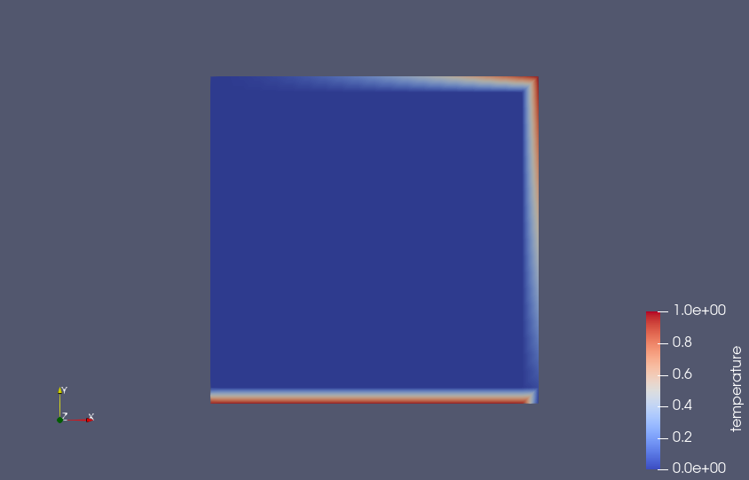

.. ## Copyright (c) 2019-2023, Lawrence Livermore National Security, LLC and
.. ## other Serac Project Developers. See the top-level COPYRIGHT file for details.
.. ##
.. ## SPDX-License-Identifier: (BSD-3-Clause)

#############################
Simple Heat Transfer Tutorial
#############################

This tutorial provides an introduction to running simulations with Serac and demonstrates
the setup of a simple steady-state thermal conduction problem.

The full source code for this tutorial is available in ``examples/simple_conduction/without_input_file.cpp``, which demonstrate Lua and C++ configuration, respectively.

The thermal conduction modeled in this section is based on the formulation discussed in :ref:`conduction-theory-label`.

Setting Up Includes and Initializing
------------------------------------

The most important parts of Serac are its physics modules, each of which corresponds to a particular discretization
of a partial differential equation (e.g., continuous vs. discontinuous Galerkin finite element methods).
In this example, we are building a thermal conduction simulation, so we include Serac's thermal conduction module:

.. literalinclude:: ../../../../examples/simple_conduction/without_input_file.cpp
   :start-after: _incl_heat_transfer_header_start
   :end-before: _incl_heat_transfer_header_end
   :language: C++

The following header provides access to the `StateManager` class which manages the individual finite element states
and the mesh:

.. literalinclude:: ../../../../examples/simple_conduction/without_input_file.cpp
   :start-after: _incl_state_manager_start
   :end-before: _incl_state_manager_end
   :language: C++

Serac also provides a set of setup/teardown functions that encapsulate much of the boilerplate setup required
for each simulation, e.g., MPI initialization/finalization and logger setup/teardown, so we include their headers:

.. literalinclude:: ../../../../examples/simple_conduction/without_input_file.cpp
   :start-after: _incl_infra_start
   :end-before: _incl_infra_end
   :language: C++

Finally, we include the header for Serac's mesh utilities, which includes support for reading meshes from a file
and for generating meshes of common solids, like cuboids, rectangles, disks, and cylinders:

.. literalinclude:: ../../../../examples/simple_conduction/without_input_file.cpp
   :start-after: _incl_mesh_start
   :end-before: _incl_mesh_end
   :language: C++

We're now ready to start our ``main()`` function by initializing Serac, which performs the setup described above:

.. literalinclude:: ../../../../examples/simple_conduction/without_input_file.cpp
   :start-after: _main_init_start
   :end-before: _main_init_end
   :language: C++

To simplify saving to an output file and restarting a simulation, Serac stores critical state information, like
the mesh and fields, in a single ``StateManager`` object, which is initialized here.

.. warning::
  Since Serac's initialization helper initializes MPI, you should not call ``MPI_Init`` directly.

Constructing the Mesh
---------------------

In this introductory example, we will use a simple square mesh with 10 quadrilateral elements in each space dimension
for 100 elements total.  Once created, the primary mesh must always be registered with the ``StateManager``: 

.. literalinclude:: ../../../../examples/simple_conduction/without_input_file.cpp
   :start-after: _create_mesh_start
   :end-before: _create_mesh_end
   :language: C++

After constructing the serial mesh, we call ``refineAndDistribute`` to distribute it into a parallel mesh.

Constructing the Physics Module
-------------------------------

.. literalinclude:: ../../../../examples/simple_conduction/without_input_file.cpp
   :start-after: _create_module_start
   :end-before: _create_module_end
   :language: C++

When using the C++ API, the ``HeatTransfer`` constructor requires the polynomial order of the elements and the
solver options to be used when inverting the stiffness matrix, in addition to the mesh.  Since we're setting up
a steady-state simulation, we can just use the ``defaultQuasistaticOptions``.

Configuring Material Conductivity
---------------------------------

Instead of using a monolithic material model, the ``HeatTransfer`` module currently allows for material parameters
like conductivity, specific heat capacity, and density to be configured individually.

.. literalinclude:: ../../../../examples/simple_conduction/without_input_file.cpp
   :start-after: _conductivity_start
   :end-before: _conductivity_end
   :language: C++

Setting Thermal (Dirichlet) Boundary Conditions
-----------------------------------------------

The following snippets add two Dirichlet boundary conditions:

- One that constrains the temperature to 1.0 at boundary attribute 1, which for this mesh corresponds
  to the side of the square mesh along the x-axis, i.e., the "bottom" of the mesh.
- One that constrains the temperature to :math:`x^2 + y - 1` at boundary attributes 2 and 3, which for
  this mesh correspond to the right side and top of the mesh, respectively.

.. literalinclude:: ../../../../examples/simple_conduction/without_input_file.cpp
   :start-after: _bc_start
   :end-before: _bc_end
   :language: C++

Running the Simulation
----------------------

Now that we've configured the ``HeatTransfer`` instance using a few of its configuration
options, we're ready to run the simulation.  We call ``completeSetup`` to "finalize" the simulation
configuration, and then save off the initial state of the simulation.  This also allocates and builds
all of the internal finite element data structures.

We can then perform the steady-state solve and save the end result:

.. literalinclude:: ../../../../examples/simple_conduction/without_input_file.cpp
   :start-after: _run_sim_start
   :end-before: _run_sim_end
   :language: C++

.. note::
  The ``dt`` variable does not actually get used in a quasistatic simulation.

This should produce the following initial state:

Note the areas of the mesh where the boundary conditions were applied.

The final (steady-state) solution should look like the following:

.. image:: final_cond_state.png

The end result is not particularly impressive, but should be fairly intuitive.

Cleaning Up
-----------

To make sure Serac terminates properly, don't forget to call its exit function at the very end of your program:

.. literalinclude:: ../../../../examples/simple_conduction/without_input_file.cpp
   :start-after: _exit_start
   :end-before: _exit_end
   :language: C++
