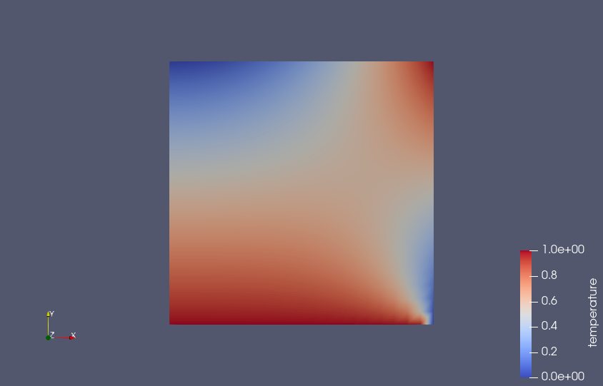

.. ## Copyright (c) 2019-2021, Lawrence Livermore National Security, LLC and
.. ## other Serac Project Developers. See the top-level COPYRIGHT file for details.
.. ##
.. ## SPDX-License-Identifier: (BSD-3-Clause)

##########################
Simple Conduction Tutorial
##########################

This tutorial provides an introduction to running simulations with Serac and demonstrates
the setup of a simple steady-state thermal conduction problem.  The tutorial also provides
a side-by-side comparison of Serac's simulation configuration methods, namely, the C++ API
and Lua input files.

The full source code for this tutorial is available in ``examples/simple_conduction/with_input_file.cpp``
and ``examples/simple_conduction/without_input_file.cpp``, which demonstrate Lua and C++ configuration, respectively.
The input file used for the Lua configuration is ``examples/simple_conduction/conduction.lua``.

The thermal conduction modeled in this section is based on the formulation discussed in :ref:`conduction-theory-label`.

Setting Up Includes and Initializing
------------------------------------

The most important parts of Serac are its physics modules, each of which corresponds to a particular discretization
of a partial differential equation (e.g., continuous vs. discontinuous Galerkin finite element methods).
In this example, we are building a thermal conduction simulation, so we include Serac's thermal conduction module:

.. literalinclude:: ../../../../examples/simple_conduction/without_input_file.cpp
   :start-after: _incl_thermal_header_start
   :end-before: _incl_thermal_header_end
   :language: C++

Serac also provides a set of setup/teardown functions that encapsulate much of the boilerplate setup required
for each simulation, e.g., MPI initialization/finalization and logger setup/teardown, so we include their headers:

.. literalinclude:: ../../../../examples/simple_conduction/without_input_file.cpp
   :start-after: _incl_infra_start
   :end-before: _incl_infra_end
   :language: C++

Finally, we include the header for Serac's mesh utilities, which includes support for reading meshes from a file
and for generating meshes of common solids, like cuboids, rectangles, disks, and cylinders:

.. literalinclude:: ../../../../examples/simple_conduction/without_input_file.cpp
   :start-after: _incl_mesh_start
   :end-before: _incl_mesh_end
   :language: C++

We're now ready to start our ``main()`` function by initializing Serac, which performs the setup described above:

.. literalinclude:: ../../../../examples/simple_conduction/without_input_file.cpp
   :start-after: _main_init_start
   :end-before: _main_init_end
   :language: C++

.. warning::
  Since Serac's initialization helper initializes MPI, you should not call ``MPI_Init`` directly.

Setting Up Inlet
----------------

This section is specific to configuration with Lua input files.  If you're just interested in using the C++
API, you can skip to `Constructing the Mesh`_.

Serac uses Axom's `Inlet <https://axom.readthedocs.io/en/develop/axom/inlet/docs/sphinx/index.html>`_ component
for defining and extracting information from input files.  Inlet is based on Axom's Sidre component, which provides
a uniform in-memory layout for simulation data.  We instantiate Inlet with a
`DataStore <https://axom.readthedocs.io/en/develop/axom/sidre/docs/sphinx/datastore.html>`_ instance (the top-level
Sidre building block) and the path to the Lua input file, which in this case is ``examples/simple_conduction/conduction.lua``:

.. literalinclude:: ../../../../examples/simple_conduction/with_input_file.cpp
   :start-after: _inlet_init_start
   :end-before: _inlet_init_end
   :language: C++

We then define the schema for the input file.  Instead of defining the structure of the input file in one place, Inlet
allows Serac to separate its schema definition logic into functions that are responsible for defining just one component
of the schema.  Since our input file contains information required for mesh construction, for Serac's ``ThermalConduction`` module,
and for the selected output type, we use Inlet to define the corresponding schemas:

.. literalinclude:: ../../../../examples/simple_conduction/with_input_file.cpp
   :start-after: _inlet_schema_start
   :end-before: _inlet_schema_end
   :language: C++

.. note::
  Since Serac's schema definition functions are independent of their location in the input file, we add a struct whose name
  corresponds to the location in ``conduction.lua`` and pass that to the appropriate schema definition function.

Because input file parsing happens when the schema is defined, there is no need to call a separate ``parse`` function.
We conclude Inlet's setup by calling the ``verify`` method, which ensures that all required data is present and meets
any other constraints:

.. literalinclude:: ../../../../examples/simple_conduction/with_input_file.cpp
   :start-after: _inlet_verify_start
   :end-before: _inlet_verify_end
   :language: C++

.. hint::
  The ``SLIC_ERROR_ROOT_IF`` macro is part of Serac's :ref:`logging-label` functionality,
  which is enabled as part of the ``serac::initialize`` function described above.

Constructing the Mesh
---------------------

In this introductory example, we will use a simple square mesh with 10 quadrilateral elements in each space dimension
for 100 elements total.

Using C++
"""""""""

.. literalinclude:: ../../../../examples/simple_conduction/without_input_file.cpp
   :start-after: _create_mesh_start
   :end-before: _create_mesh_end
   :language: C++

After constructing the serial mesh, we call ``refineAndDistribute`` to distribute it into a parallel mesh.

Using Lua
"""""""""

.. literalinclude:: ../../../../examples/simple_conduction/with_input_file.cpp
   :start-after: _create_mesh_start
   :end-before: _create_mesh_end
   :language: C++

This snippet queries Inlet's internal hierarchy at the location where we defined the mesh schema (``main_mesh``),
and reads the data into the ``struct`` Serac uses for storing mesh creation options, which is all we need to
construct the mesh.  The Lua representation is as follows:

.. literalinclude:: ../../../../examples/simple_conduction/conduction.lua
   :start-after: _mesh_start
   :end-before: _mesh_end
   :language: Lua

Constructing the Physics Module
-------------------------------

Using C++
"""""""""

.. literalinclude:: ../../../../examples/simple_conduction/without_input_file.cpp
   :start-after: _create_module_start
   :end-before: _create_module_end
   :language: C++

When using the C++ API, the ``ThermalConduction`` constructor requires the polynomial order of the elements and the
solver options to be used when inverting the stiffness matrix, in addition to the mesh.  Since we're setting up
a steady-state simulation, we can just use the ``defaultQuasistaticOptions``.

Using Lua
"""""""""

Once the configuration options are read from Inlet, we can use them to construct the ``ThermalConduction``
object:

.. literalinclude:: ../../../../examples/simple_conduction/with_input_file.cpp
   :start-after: _create_module_start
   :end-before: _create_module_end
   :language: C++

Unlike the C++-only version, we don't need to specify the order or the solver options in the constructor
because they're in the input file:

.. literalinclude:: ../../../../examples/simple_conduction/conduction.lua
   :start-after: _solver_opts_start
   :end-before: _solver_opts_end
   :language: Lua

Configuring the Physics Module
------------------------------

The following sections demonstrate a subset of the configuration options available with Serac's
``ThermalConduction`` module.

.. note::
  The C++-only API requires method calls for configuration, while the Lua-based approach typically only requires changes
  to the input file.  This is because the configuration options are all part of the ``ThermalConduction::InputOptions``
  extracted from Inlet.

Configuring Material Conductivity
---------------------------------

Instead of using a monolithic material model, the ``ThermalConduction`` module currently allows for material parameters
like conductivity, specific heat capacity, and density to be configured individually.

Using C++
"""""""""

.. literalinclude:: ../../../../examples/simple_conduction/without_input_file.cpp
   :start-after: _conductivity_start
   :end-before: _conductivity_end
   :language: C++

Using Lua
"""""""""

.. literalinclude:: ../../../../examples/simple_conduction/conduction.lua
   :start-after: _conductivity_start
   :end-before: _conductivity_end
   :language: Lua

Setting Thermal (Dirichlet) Boundary Conditions
-----------------------------------------------

The following snippets add two Dirichlet boundary conditions:

- One that constrains the temperature to 1.0 at boundary attribute 1, which for this mesh corresponds
  to the side of the square mesh along the x-axis, i.e., the "bottom" of the mesh.
- One that constrains the temperature to :math:`x^2 + y - 1` at boundary attributes 2 and 3, which for
  this mesh correspond to the right side and top of the mesh, respectively.

Using C++
"""""""""

.. literalinclude:: ../../../../examples/simple_conduction/without_input_file.cpp
   :start-after: _bc_start
   :end-before: _bc_end
   :language: C++

Using Lua
"""""""""

.. literalinclude:: ../../../../examples/simple_conduction/conduction.lua
   :start-after: _bc_start
   :end-before: _bc_end
   :language: Lua

.. note::
  The exact names here are not critical, any entry whose name contains the string ``temperature``
  will be applied as a Dirichlet condition to the temperature field.

Setting Output Type
-------------------

.. hint::
  Serac currently supports ``VisIt``, ``ParaView``, ``GLVis``, and ``SidreVisit`` output.

Using C++
"""""""""

.. literalinclude:: ../../../../examples/simple_conduction/without_input_file.cpp
   :start-after: _output_type_start
   :end-before: _output_type_end
   :language: C++

Using Lua
"""""""""

In the input file (``conduction.lua``):

.. literalinclude:: ../../../../examples/simple_conduction/conduction.lua
   :start-after: _output_type_start
   :end-before: _output_type_end
   :language: Lua

In the C++ driver:

.. literalinclude:: ../../../../examples/simple_conduction/with_input_file.cpp
   :start-after: _output_type_start
   :end-before: _output_type_end
   :language: C++

Running the Simulation
----------------------

Now that we've configured the ``ThermalConduction`` instance using a few of its configuration
options, we're ready to run the simulation.  We call ``completeSetup`` to "finalize" the simulation
configuration, and then save off the initial state of the simulation.  This also allocates and builds
all of the internal finite element data structures.

We can then perform the steady-state solve and save the end result:

.. literalinclude:: ../../../../examples/simple_conduction/without_input_file.cpp
   :start-after: _run_sim_start
   :end-before: _run_sim_end
   :language: C++

.. note::
  The ``dt`` variable does not actually get used in a quasistatic simulation.

This should produce the following initial state:

.. image:: initial_cond_state.png

Note the areas of the mesh where the boundary conditions were applied.

The final (steady-state) solution should look like the following:

The end result is not particularly impressive, but should be fairly intuitive.

Cleaning Up
-----------

To make sure Serac terminates properly, don't forget to call its exit function at the very end of your program:

.. literalinclude:: ../../../../examples/simple_conduction/without_input_file.cpp
   :start-after: _exit_start
   :end-before: _exit_end
   :language: C++
